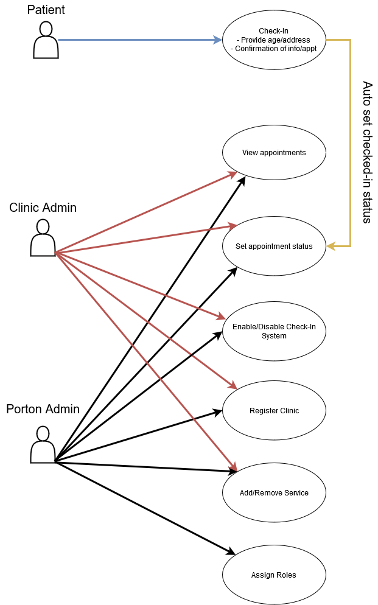

# Repo Links

- [Front End](https://github.com/carrotcorn/PortonHealthKioskFrontend)
- [Back End](https://github.com/carrotcorn/PortonHealthKioskBackend)

# Functional Requirements

## Week one functionality

- Backend

  - Auth with varying privileges
    - Porton admin role
    - Clinic admin role
  - Ability to add/disable clinic accounts

- Frontend
  - Porton Admin portal
    - Add/Disable Clinic accounts
  - Clinic portal

## Need to Have

- Check-in Support
  - Patient
    - UI to initiate check-in flow
    - Prompt for address/age
    - Confirmation screen for appointment time/details (doctor info, reason for visit)
    - Confirmation screen for patient info?
  - Clinic Admin
    - View for booked appointments
      - patient name
      - doctor name
      - time
      - status
    - Status of an appointment
      - missed
      - removed
      - completed/uncompleted toggle
      - in-progress (would be set automatically when patient checks in)

## Nice to Have

- Scheduling
- Modify an appointment
- Request to speak in person

## Extended Functionality

- Reporting

# Use Case Diagram

# Wireframe

https://www.figma.com/file/ArnNiZ1HjBDJTxPNqpjgsh/Porton-Health-Industry-Project?node-id=0%3A1
